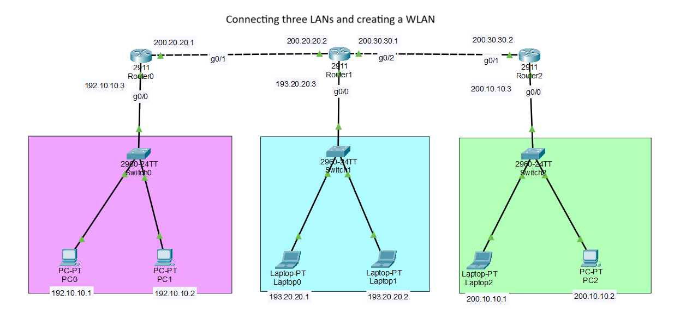
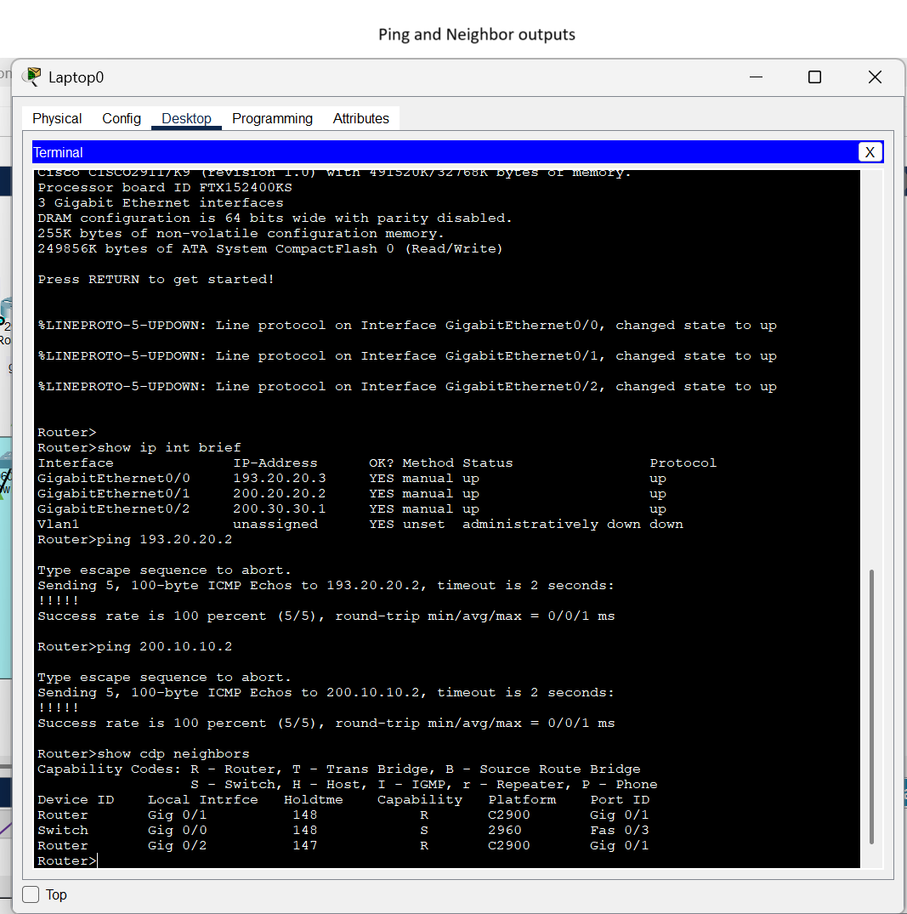
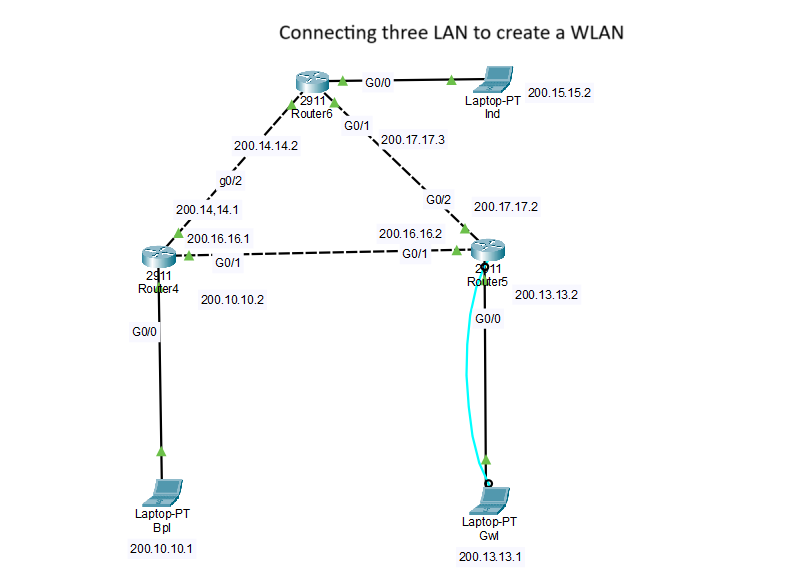
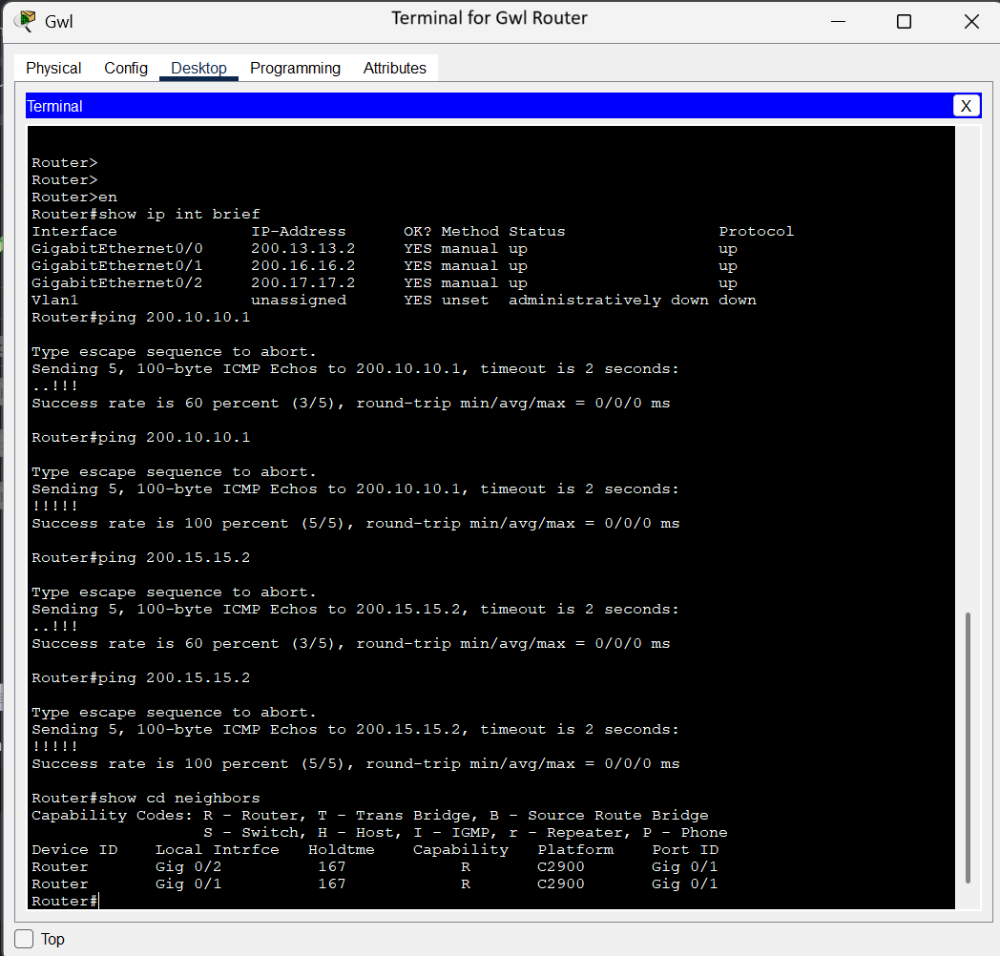

# 🧪 Router & Switch Lab Portfolio

This repository contains my hands-on networking projects built using Cisco Packet Tracer as part of my CCNA and NetAcad learning. The labs demonstrate my understanding of network device configuration, VLAN setup, static routing, and connectivity verification through CLI.

---

## 📁 Lab Projects

### 🔹 [Simple Setup](./simple-setup/)
A basic router-switch-PC topology to demonstrate:
- Static IP configuration
- Router interface setup
- Successful ping tests between hosts
- CDP neighbor discovery

📸 Screenshots:
- 
- 

---

### 🔸 [Complex Setup](./complex-setup/)
A multi-router setup simulating inter-network communication with static routes.

Key highlights:
- Static routes between routers
- Multiple interfaces and subnets
- Progressive ping success (60% ➝ 100%)
- CDP neighbor visibility between routers

📸 Screenshots:
- 
- 

---

## 📜 Output Summary

### 🔹 Simple Output Highlights
- Device: `Laptop0 Router`
- All interfaces UP and IPs assigned
- 100% ping success to peer IPs
- CDP reveals 1 switch and 2 routers

### 🔸 Complex Output Highlights
- Device: `Gwl Router`
- All interfaces UP, multiple subnets configured
- Initial ping 60% ➝ retried to 100% success
- CDP reveals 2 routers connected

---

## 🧠 Skills Demonstrated

- Static IP & interface configuration
- Inter-device communication (ping, CDP)
- Static routing (in complex setup)
- Packet Tracer simulation documentation

---

## 🧰 Tools Used
- Cisco Packet Tracer
- NetAcad (CCNA modules, Python Essentials 1 & 2, Cybersecurity Intro)
- GitHub for version control and portfolio hosting

---

## 📌 Author
[Sahil Chaurasiya](https://github.com/<your-github-username>)  
Bhopal, India  
Aspiring Network Engineer | CCNA Learner

---

⭐ **Feel free to fork, use, or refer to these labs as a reference for your own networking practice.**
