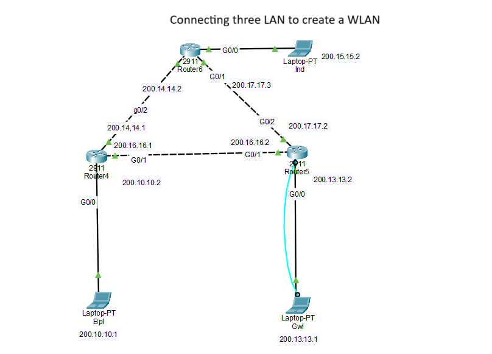

# 🧪 Complex Router-to-Router Lab

This folder contains a multi-router topology simulating inter-network communication using static routing.

## 📄 Files

- `complex_project.pkt` — The Packet Tracer project file
- `complex_topology.png` — Screenshot of the complex layout
- `complex_output.png` — CLI output showing interface status, ping tests, and CDP neighbors

## ✅ Key Concepts Demonstrated

- Multi-router static routing configuration
- Progressive ping test results
- Inter-device communication across networks
- CDP (Cisco Discovery Protocol) neighbor visibility

## 📸 Screenshots

- 
- 

