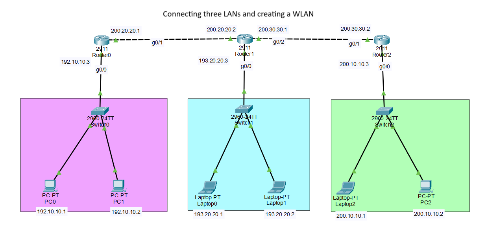
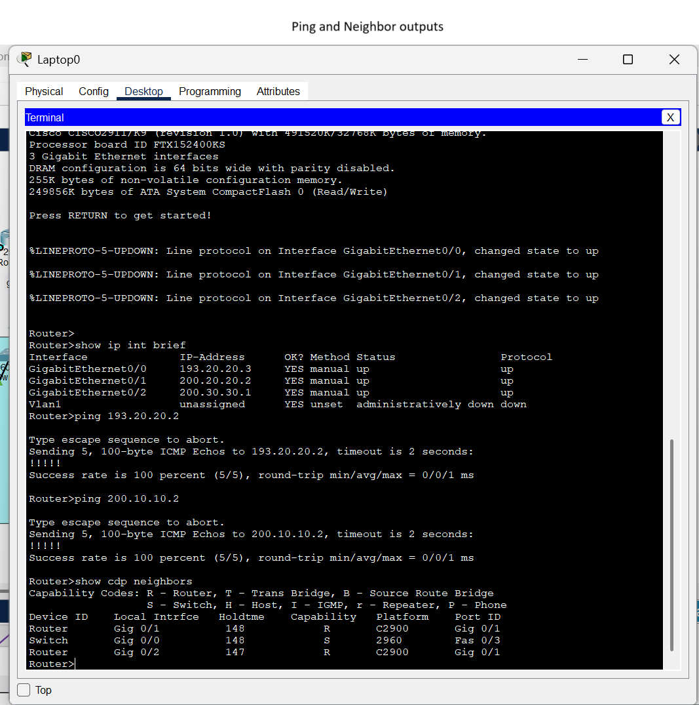

# 🧪 Simple Router-Switch Lab

This folder contains a basic network topology built using Cisco Packet Tracer.

## 📄 Files

- `simple_project.pkt` — The Packet Tracer project file
- `simple_topology.png` — Screenshot of the network layout
- `simple_output.png` — CLI output showing successful configuration and connectivity

## ✅ Key Concepts Demonstrated

- Static IP addressing
- Basic router and switch configuration
- Successful ping tests between devices
- CDP (Cisco Discovery Protocol) neighbor discovery

## 📸 Screenshots

- 
- 
